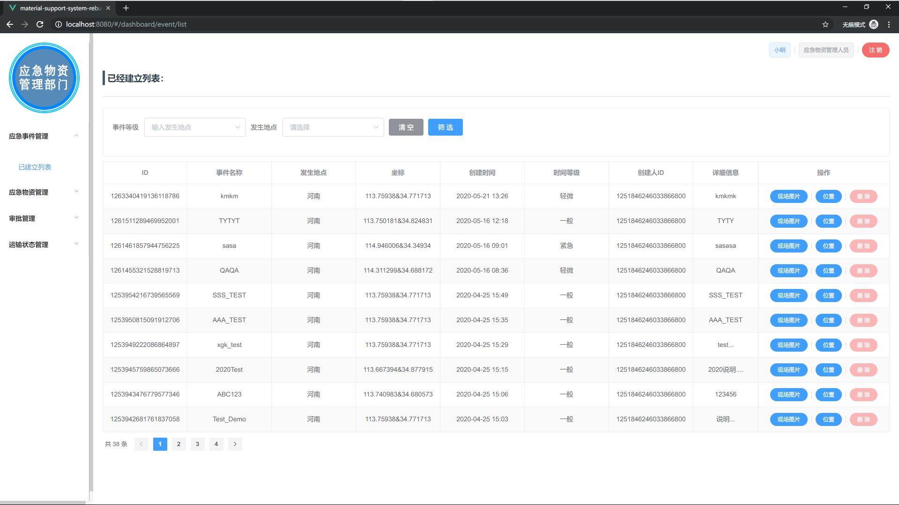
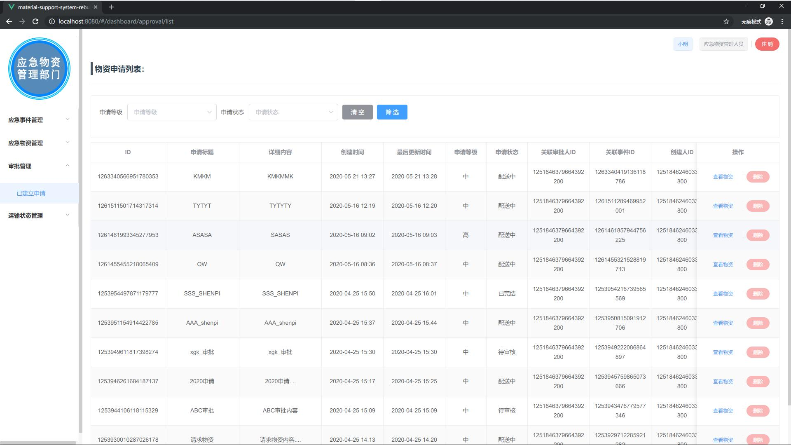
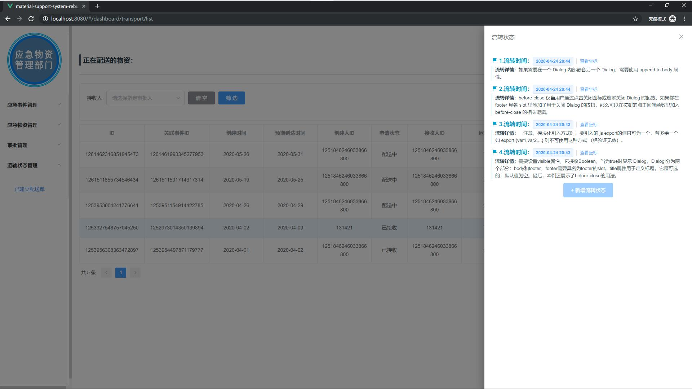
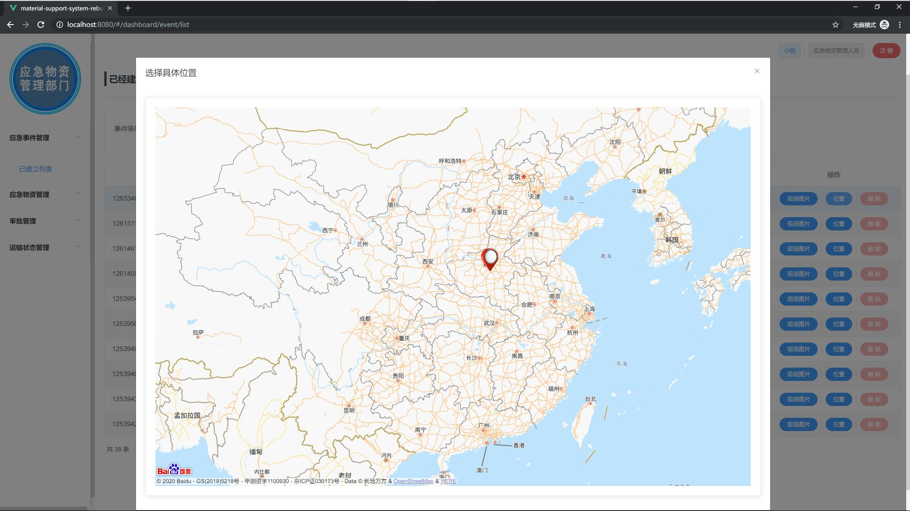
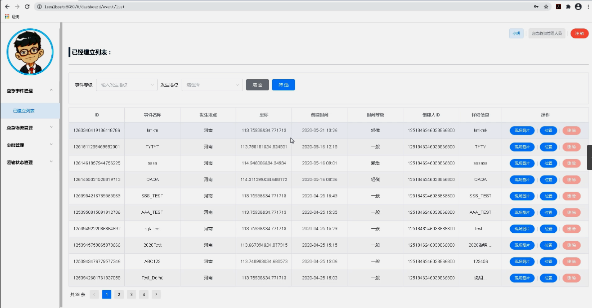
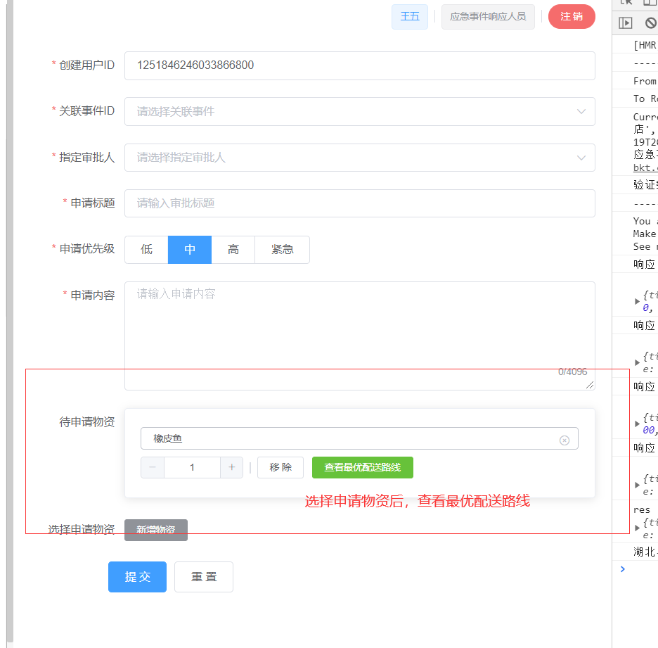
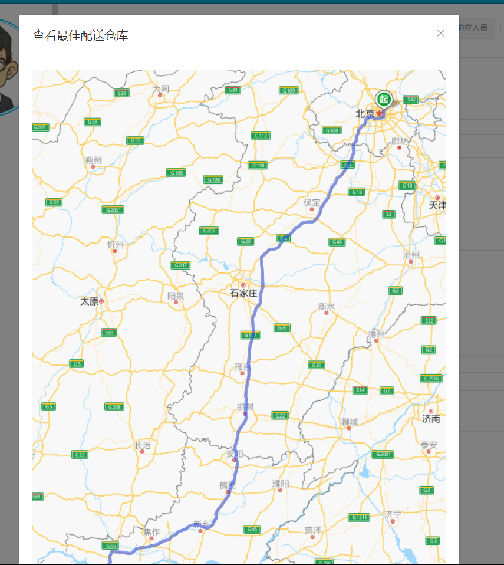
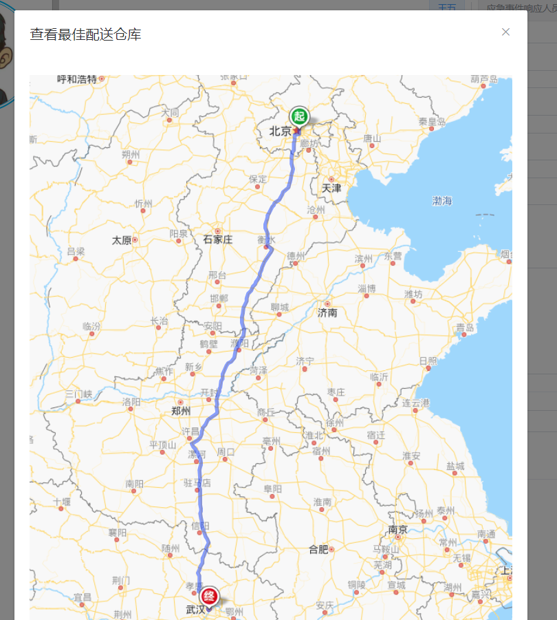
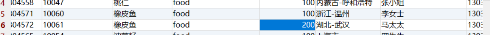
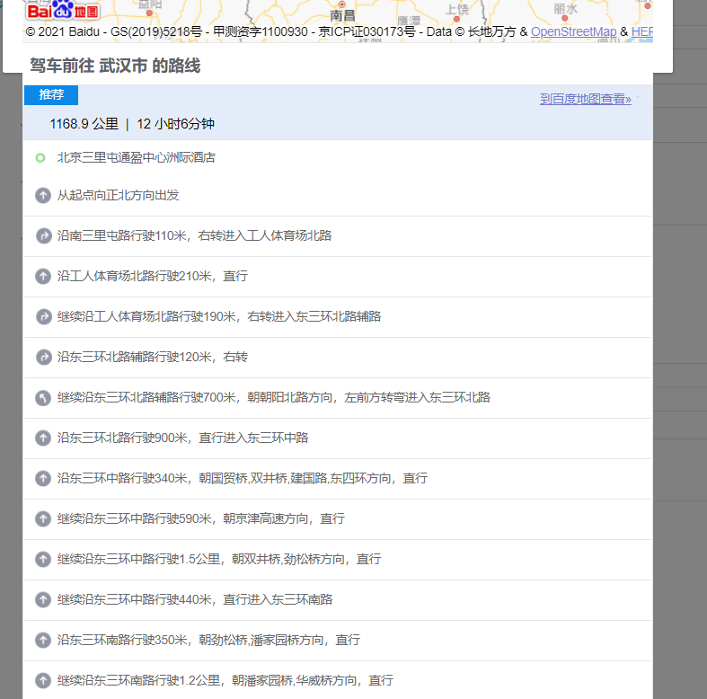

## SpringBoot+Vue.js应急物资调度系统(调度算法) 应急物资保障系统

## 要求
源码一套有偿(论文 开题报告  文献综述  源码+sql脚本)
加好友前帮忙start一下，并备注github有偿获取源码
我的QQ号是2877135669或者2827724252
加qq好友说明（被部分 网友整得心力交瘁）：
    1.加好友务必按照格式备注
    2.避免浪费各自的时间！
    3.当“客服”不容易，repo 主是体面人，不爆粗，性格好，文明人。

https://www.bilibili.com/video/BV1RN41197sm?spm_id_from=333.999.0.0

## 功能

疫情物资，疫情物资分类管理模块： 该模块主要是对疫情物资以及其分类进行统一的管理，包含对疫情物资的新增，支出，信息更新，删除。并提供了多种筛选方式可以边快速的获取到疫情物资的当前情况。针对物资分类也提供了类似的功能。
应急事件管理模块： 该模块作为疫情物资调度的先导而存在，可以通过该模块进行应急事件的建立，维护，并可以按照实际生活中的处理进度，更新某个应急事件的处理状态。进行统一的跟进，同时可以在该界面获取到历史的应急事件以及其处理状态，通过多种方式筛选出指定的数据，然后提供了针对某一个应急事件的物资申请发起的功能，可以为这个事件申请物资。
审批模块： 该模块主要是配合应急事件管理模块，对来自该模块下建立的申请进行审批，结合实际的情况进行处理，选择通过审批或者驳回。只有经过审批之后，相关的流程才可以继续流转下去。
疫情物资运输模块：
通过该模块可以对已经通过审批的申请建立物资运输单，进而对申请的物资进行运输工作，并且可以在这个过程中对其进行物资的流转等操作，应急事件管理人员也可以在该模块下选择结束流转一个运输单，表示已经收到了物资。
系统模块： 通过该模块对用户的信息进行管理，进行登录验证，用户权限判断等操作，并且按照用户的身份为其生成菜单。并记录其操作日志。

# 技术

springboot+vue.js

地图API

调度算法

多角色登录

流程化activity

​	

# 运行截图

# 运行视频B站
https://www.bilibili.com/video/BV1RN41197sm?spm_id_from=333.999.0.0

